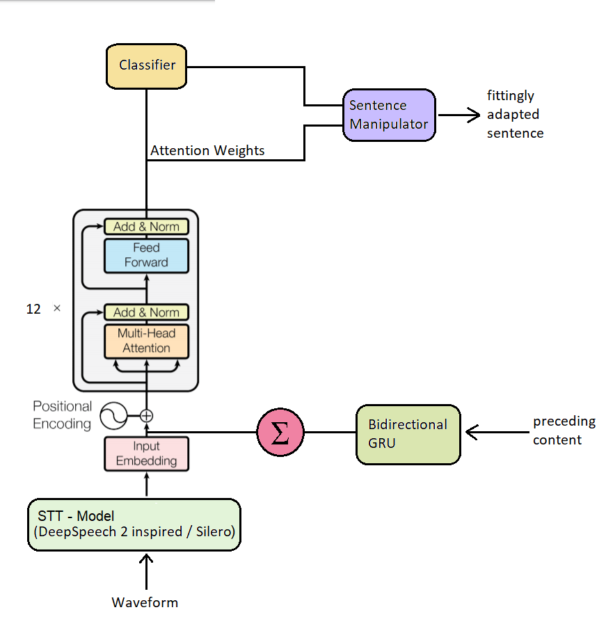

# IronyDetection

Model Architecture (Transformer based):


PyTorch source code changes necessary:

``...\lib\site-packages\torch\nn\functional.py``

Usually at the very bottom / end of the file (currently line 5070; 05/16/2021 @ 10:00pm UTC).
Change:
```
[-] return attn_output, attn_output_weights.sum(dim=1) / num_heads
[+] return attn_output, attn_output_weights
```
